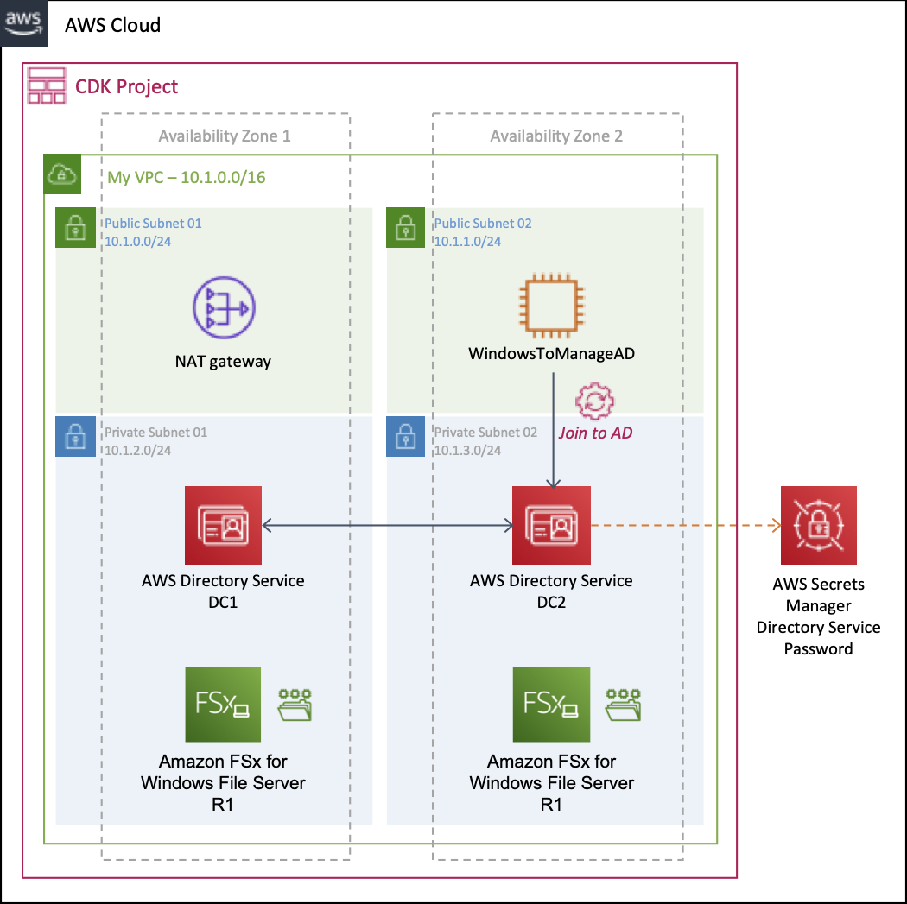
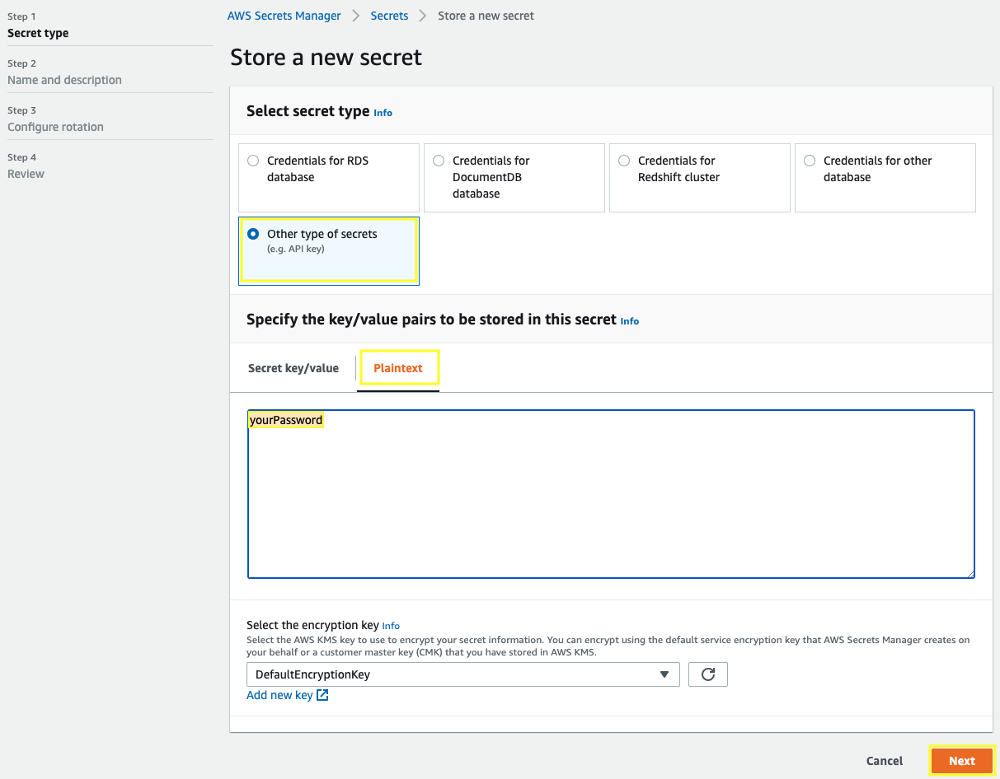

# AWS Directory Service and Amazon FSx for Windows File with CDK



## Requirements for development environment

Work inside your AWS Cloud9 environment - [Create an EC2 Environment](https://docs.aws.amazon.com/cloud9/latest/user-guide/create-environment-main.html#create-environment-console)

Install the latest version of CDK.

``` bash
npm install -g aws-cdk --force
```

## Creating a basic secret to store the Direcotry Service password

Open the AWS Secrets Manager console at https://console.aws.amazon.com/secretsmanager/.

Choose **Store a new secret**.

In the **Select secret type** section, choose **Other type of secrets**, specify your password in **Plaintext** and choose **Next**.



For **Secret name**, type `directoryServicePassword` and choose **Next**.

For **Configure rotation** section, leave the default configuration and choose **Next**.

Review your settings, and then choose **Store** secret to save.

## Creating, initializing and deploying an AWS CDK project

Create a directory for your CDK project.

``` bash
mkdir cdk-directoryservice-and-fsx
cd cdk-directoryservice-and-fsx
```

To initialize your new CDK project use the cdk init command as follows.

``` bash
cdk init --language typescript
```

Install the AWS modules and all it’s dependencies into your project.

``` bash
npm install @aws-cdk/aws-ec2 @aws-cdk/aws-directoryservice @aws-cdk/aws-ssm @aws-cdk/aws-iam @aws-cdk/aws-fsx
```

Replace the following files with the samples codes linked.

- [lib/cdk-directoryservice-and-fsx-stack.ts](lib/cdk-directoryservice-and-fsx-stack.ts)
- [bin/cdk-directoryservice-and-fsx.ts](bin/cdk-directoryservice-and-fsx.ts)
  - Change the **directoryServiceName** value with the name for your directory service.
  - Change the **directoryServiceShortName** value with the short name for your directory service.
  - Change the **directoryServicePasswordSecret** value with the name of your secret.
  - Change the **fsxStorageCapacity** with your value.
  - Change the **fsxThroughputCapacity** with your value.
- [test/cdk-directoryservice-and-fsx.test.ts](test/cdk-directoryservice-and-fsx.test.ts)

Build the project.

``` bash
npm run build
```

Deploy the stack, **it will take a few minutes to complete**.

``` bash
cdk deploy
```

## Connect to your Windows Manage AD instance

Open the Amazon EC2 console at https://console.aws.amazon.com/ec2.

Click on **Instances** in the **INSTANCES** section. This will display a page to manage your instances.

Select your **WindowsManageAD** and choose **Connect**.

Click on **Download Remote Desktop File** and **Close** the window.

Ope your **.rdp** file, you'll see the Remote Desktop Connection dialog box, for **Username** type the directory service name with the Admin user as follows: `aurbac.kabits.com\Admin` and type the password stored in AWS Secrets Manager.

## Connect to the Windows File Server

In the **File Explorer**, open the context (right-click) menu for **Network** and choose **Map Network Drive**.


Choose a drive letter of your choice for Drive, by default is **Z**.

Enter the fully qualified domain name (FQDN) name for your file share. You construct this name from the FQDN of your file system and the name of your Windows file share. For **Folder** type `\\<FileSystemId>.corp.example.com\share` where `<FileSystemId>` is replaced with the Value copied earlier. (Copy from cloudformation output)

Choose whether the file share should **Reconnect at sign-in** and then choose **Finish**.


Now you will see your file share as a **Z** drive.

