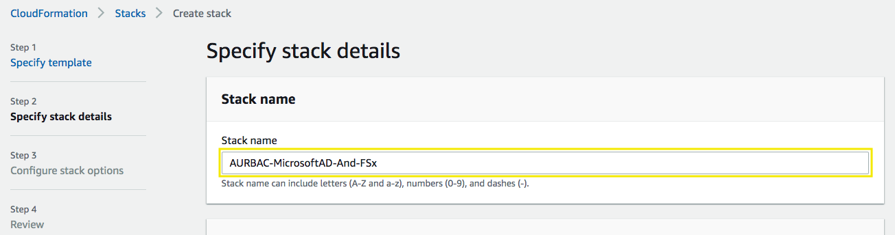
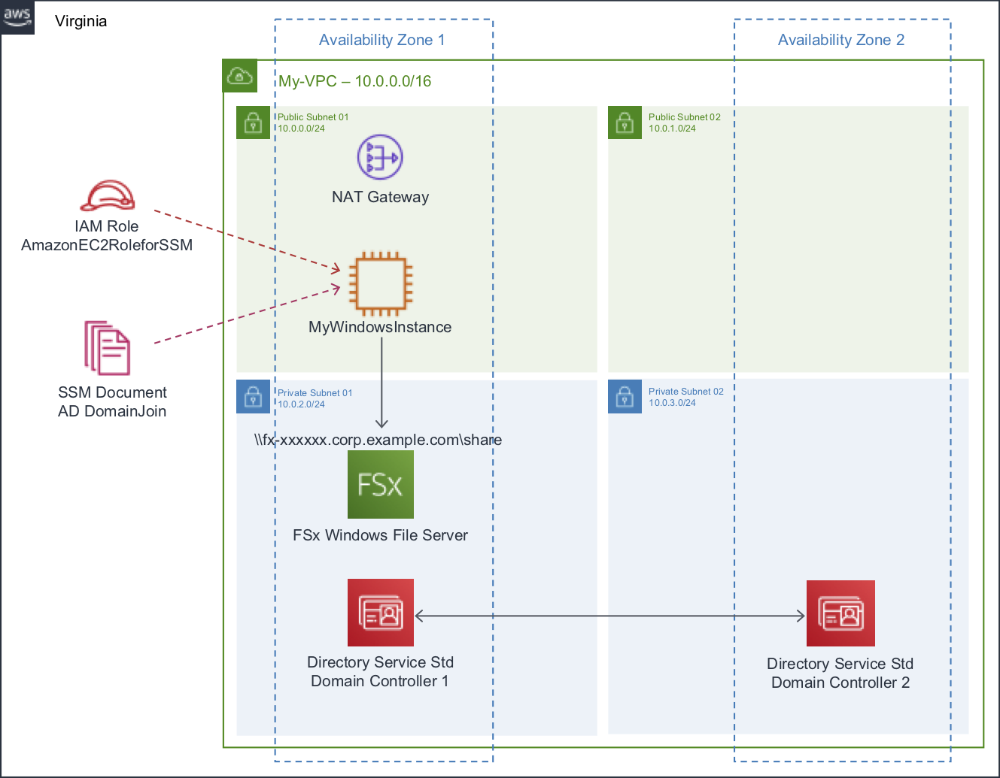

# AWS Managed Microsoft AD and Amazon FSx for Windows File Server

Log into the AWS Management Console and choose the [N. Virginia Region](http://docs.aws.amazon.com/AWSEC2/latest/UserGuide/using-regions-availability-zones.html).

## 1. Create a Key Pair

You will need to get into your Windows instance, using the private key you will obtain the Administrator password and then login using RDP.

1.1\. Open the Amazon EC2 console at https://console.aws.amazon.com/ec2.

1.2\. Click on **Key Pairs** in the **NETWORK & SECURITY** section. This will display a page to manage your key pairs.

1.3\. To create a new key pair, click the **Create Key Pair** button.

1.4\. In the resulting pop up window, for **Key Pair Name** type `my-keypair` and click **Create**.

1.5\. The private key file is automatically downloaded by your browser. The base file name is the name you specified as the name of your key pair, and the file name extension is .pem. Save the private key file in a safe place.

## 2. Create the AWS Managed Microsoft AD and Amazon FSx for Windows File Server using CloudFormation

2.1\. Download the [CloudFormation template AURBAC-MicrosoftAD-And-FSx.json](scripts/AURBAC-MicrosoftAD-And-FSx.json), we are going to use it to create the environment and services required.

2.2\. Open the AWS CloudFormation console at https://console.aws.amazon.com/cloudformation.
  
2.3\. In **Stacks** section choose **Create Stack**.

2.4\. In the **Create stack** section, select **Template is ready**, select **Upload a template file** and **Choose file** for the template downloaded **AURBAC-MicrosoftAD-And-FSx.json** and click **Next**.

2.5\. In the **Specify stack details** section, for **Stack name** type `MicrosoftAD-And-FSx` to identify the cloudformation stack.

2.6\. For **KeyName** select your key pair created previously.

2.7 Review the default values, just remember that the **Password** for your Active Directory will be **`MicrosoftADPW123*`** as default, you can change it if you want, scroll down and click **Next**.

2.8\. For the **Configure stack options** section choose **Next**.

2.9\. For the **Review MicrosoftAD-And-FSx** section, check the box for **I acknowledge that AWS CloudFormation might create IAM resources with custom names.** and click **Create Stack**.

2.10\. It will take about 45 minutes while your stack is being created, it is listed on the **Stacks** page with a status of **CREATE_IN_PROGRESS**.

2.11\. After your stack has been successfully created, its status changes to **CREATE_COMPLETE**. You can then click the **Outputs** tab to view your stack's outputs required for the following configurations.

**Copy the Value for FileSystemId, you will use it later.**

### AWS Services created

* One Amazon VPC environment with two public and two private subnets.
* One Microsoft AD Standard.
* One EC2 instance with Windows 2016 (t3.medium).
* One Amazon FSx for Windows File Server

## 3. Connect to your Windows File Share

3.1\. Open the Amazon EC2 console at https://console.aws.amazon.com/ec2.

3.2\. Click on **Instances** in the **INSTANCES** section. This will display a page to manage your instances.

3.3\. Select your **MyWindowsInstance** and choose **Connect**.

3.4\. Click on **Download Remote Desktop File** and **Close** the window.

3.5\. Ope your **.rdp** file, you'll see the Remote Desktop Connection dialog box, for **Username** type `corp.example.com\Admin` and for **Password** type `MicrosoftADPW123*`, and choose **Continue**.

3.6\. Once connected, open File Explorer.

3.7\. From the navigation pane, open the context (right-click) menu for **Network** and choose **Map Network Drive**.

3.8\. Choose a drive letter of your choice for Drive, by default is **Z**.

3.9\. Enter the fully qualified domain name (FQDN) name for your file share. You construct this name from the FQDN of your file system and the name of your Windows file share. For **Folder** type `\\<FileSystemId>.corp.example.com\share` where `<FileSystemId>` is replaced with the Value copied earlier.

3.10\. Choose whether the file share should **Reconnect at sign-in** and then choose **Finish**.

3.11\. Now you will see your file share as a **Z** drive.

